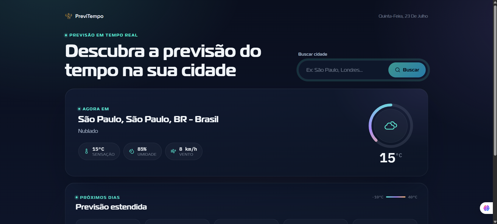

# 🌤️ Dashboard de Clima | Weather Forecast App


> Aplicação web interativa para consulta de previsão do tempo em tempo real, construída com **React**, **Vite** e integração com a **Open-Meteo API** e **Geolocalização**.

---

## 📌 Sobre o Projeto

O **Dashboard de Clima** foi desenvolvido com o objetivo de consolidar arquitetura de componentes e consumo assíncrono de APIs no ecossistema React moderno. 

O foco principal da aplicação esteve no aprendizado prático de:
- **Componentização limpa e reutilizável**: Separação clara de responsabilidades da interface.
- **Hooks & Custom Hooks**: Gerenciamento eficiente de estado e efeitos de ciclo de vida (`useState`, `useEffect`).
- **Consumo de API Rest & Geolocalização**: Integração assíncrona com os endpoints da Open-Meteo para obter o clima atual e a previsão dos próximos dias.
- **Tratamento de UX/UI**: Tratamento de estados de *loading*, tratamento defensivo de erros (cidades não encontradas ou falhas de rede) e layout responsivo (*Mobile First*).

---

## 🖥️ Demonstração do Projeto



---

## ✨ Funcionalidades

| Funcionalidade | Descrição |
| :--- | :--- |
| 🔍 **Busca por Cidade** | Pesquisa dinâmica de previsão do tempo para qualquer localidade. |
| 📍 **Geolocalização & Carga Inicial** | Carregamento automático via geolocalização do navegador ou cidade padrão (*Rio de Janeiro*). |
| 🌡️ **Métricas em Tempo Real** | Exibição de temperatura atual, sensação térmica, umidade relativa e velocidade do vento. |
| 📅 **Previsão Estendida** | Projeção meteorológica detalhada para os próximos dias. |
| 🎨 **Ícones Dinâmicos** | Identificação visual das condições do tempo com base no WMO Code retornado pela API. |
| ⚡ **Estados da Aplicação** | Indicadores visuais de carregamento (*loading skeletons/spinners*) e mensagens amigáveis de erro. |
| 📱 **Design Responsivo** | Interface adaptável e otimizada para desktops, tablets e smartphones. |

---

## 🛠️ Tecnologias Utilizadas

- **Frontend:** React, HTML5, CSS3, JavaScript (ES6+)
- **Build Tool:** Vite
- **API:** Open-Meteo API (Previsão Meteorológica e Geocoding)
- **Versionamento:** Git e GitHub

---

## 🚀 Como Executar o Projeto Localmente

### Pré-requisitos
Antes de começar, você precisará ter instalado em sua máquina:
- Node.js (versão 18 ou superior)
- Gerenciador de pacotes `npm` ou `yarn`

### Passos
1. **Clone este repositório:**
   ```bash
   git clone [https://github.com/SEU_USUARIO/projeto-metereologia.git](https://github.com/SEU_USUARIO/projeto-metereologia.git)
